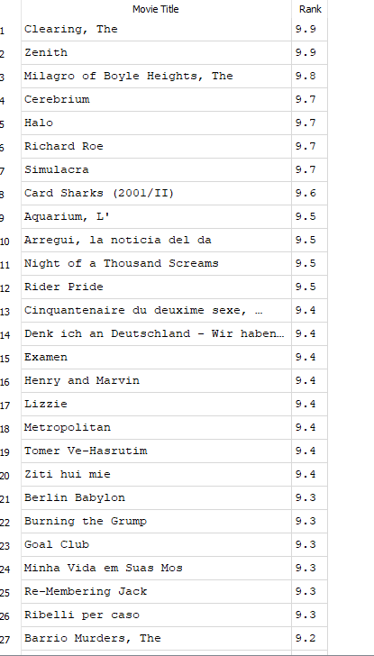

## In this first set of queries, I'd be answering 4 questions about the IMDB database. 
### 1. List all the actors who acted in at least one movie in the 2nd half of the 19th century and at least one movie in the 1st half of the 20th century

- To find actors who acted in at least one movie in the 2nd half of the 19th century (1851-1900) and at least one movie in the 1st half of the 20th century (1901-1950), you can use the following SQL query:

We are selecting first name, last name, and ID for all actors who acted in at least one movie between 1851 and 1900.
```

SELECT
    a.first_name AS "First name", 
    a.last_name AS "last name", 
    a.id AS "ID"
FROM actor a

--this section joins the actor,cast and movie tables to find the actors and the movies they acted in. 
JOIN cast c ON a.id = c.actor_id
JOIN movie m ON c.movie_id = m.id
  WHERE m.year BETWEEN 1851 AND 1900

INTERSECT
--INTERSECT makes sure that we only get actors who appear in both time periods (1851 - 1900 and 1901 - 1950).

SELECT
    a.first_name AS "First name", 
    a.last_name AS "last name", 
    a.id AS "ID"
FROM actor a 

JOIN cast c ON a.id = c.actor_id
JOIN movie m ON c.movie_id = m.id
WHERE m.year BETWEEN 1901 AND 1950;
```
Here’s a sample result showing the first name, last name, and ID of all actors who appeared in at least one movie in the second half of the 19th century and at least one movie in the first half of the 20th century.


### 2. List all the directors who directed a movie in a leap year 

- To list all the directors who directed at least one movie in a leap year, you can use the following SQL query:

```
SELECT DISTINCT --the DISTINCT function ensures that each director only show up once, even if they directed multiple movie in leap years.
    d.id AS "Director ID", 
    d.first_name AS "First name", 
    d.last_name AS "Last name"
FROM director d

--join the director, movie_director, and movie tables to find all directors of movies released in leap years.
JOIN movie_director md ON d.id = md.director_id
JOIN movie m ON md.movie_id = m.id

WHERE 
--A leap year occurs if the year is divisible by 400 or divisible  by 4 AND not divisible by 100.
	(m.year % 400 = 0) OR (m.year % 4 = 0 AND m.year % 100 != 0);

```
Here is the sample result showing the first name, last name, and ID of all directors who directed at least one movie in a leap year.


We can take it a step further and find the names of the movies they directed.

```
SELECT DISTINCT --the DISTINCT function ensures that each director only show up once, even if they directed multiple movie in leap years.
	d.id AS "Director ID", 
	d.first_name AS "First name", 
	d.last_name AS "Last name",
name AS "Movie name" 
FROM director d

--join the director, movie_director, and movie tables to find all directors of movies released in leap years.
JOIN movie_director md ON d.id = md.director_id
JOIN movie m ON md.movie_id = m.id
WHERE 
--to find the leap year
--A leap year occurs if the year is divisible by 400 or divisible  by 4 AND not divisible by 100.
	(m.year % 400 = 0) OR (m.year % 4 = 0 AND m.year % 100 != 0);

```
To display the names of the movies, I added a new column by adding a new line of code "name AS "Movie name"".

Here is the sample result showing the name of the directors, their ID, as well as the name of all the movies they directed in a leap year:


### 3. List all the movies that have the same year as the movie 'Shrek (2001)', but a better rank. (Note: a bigger value of rank implies a better rank.) The ranking for 'Shrek (2001)' is 8.1. 

To do this, we use the following query:
```
SELECT DISTINCT
	name AS "Movie Title",
	rank AS " Rank"
FROM movie
--filters out movies that were released in 2001 and have a higher ranking than 8.1 
WHERE year = "2001" AND rank > 8.1

```
Sample result for movies released in 2001 with a better rank than Shrek(2001). 


- To go a step further, we can decide to order by rank to get the highest-ranking movies 

```
SELECT DISTINCT
	name AS "Movie Title",
	rank AS " Rank"
FROM movie
--filters out movies that were released in 2001 and have a higher ranking than 8.1 
WHERE year = "2001" AND rank > 8.1
ORDER BY Rank DESC

```


Here we go! Now we see the movies with the highest rank. 

- Now let's try to add the genre. Let's see what genre these movies belong to.
```
SELECT DISTINCT
	name AS "Movie Title",
	rank AS " Rank",
	genre as "Genre"
FROM movie m
--join the movie and movie_genre table to get the genre 
JOIN movie_genre mg ON m.id = mg.movie_id
--filters out movies that were released in 2001 and have a higher ranking than 8.1 
WHERE year = "2001" AND rank > 8.1
ORDER BY Rank DESC

```
Result.


We achieved this by joining the 'movie' and 'movie_genre' tables to get the genre. 

- Another step further, let's say we want to see movies that belong in the same genre as Shrek, were released in 2001, and have higher ratings than Shrek. 
To do this, we first need to know what genre Shrek belongs to.

According to the database, Shrek (2001) falls within the following genre:


Now let's write our query where we filter by genre to get our desired result. 
```
SELECT DISTINCT
	name AS "Movie Title",
	rank AS " Rank",
	genre as "Genre"
FROM movie m
--join the movie and movie_genre table to get the genre 
JOIN movie_genre mg ON m.id = mg.movie_id
--filters out movies that were released in 2001 and have a higher ranking than 8.1 
WHERE genre = "Adventure" AND year = "2001" AND rank > 8.1
ORDER BY Rank DESC

```
Here we see movies that fall in the Adventure genre as Shrek.


These movies share the same 'Family' genre as Shrek.


These movies belong to the same 'Romance' genre as Shrek.


- Finally, we determine that we don't want movies that are ranked higher than Shrek; instead, we want movies have the same ranking as Shrek, released in the same year, and are in the same genre.
How do we do that? Let's adjust our code.

```
SELECT DISTINCT
	name AS "Movie Title",
	rank AS " Rank",
	genre as "Genre"
FROM movie m
--join the movie and movie_genre table to get the genre 
JOIN movie_genre mg ON m.id = mg.movie_id
--filters out movies that were released in 2001 and have a higher ranking than 8.1 
WHERE genre = "Romance" AND year = "2001" AND rank = 8.1
ORDER BY Rank DESC   

```


Now we see movies that have the same ranking, were released same year, and share genre as Shrek(2001)


### 4. List the first name and last name of all the actors who played in the movie 'Officer 444 (1926)'

- To list the first and last names of all actors who played in the movie 'Officer 444 (1926)', use the following SQL query:

```
--DISTINCT is used to avoid duplicates
SELECT DISTINCT
	a.first_name AS "First Name",
	a.last_name AS "Last name" 
FROM actor a
--Join the actor, cast, and movie tables to connect actors with their roles in movies.
JOIN cast c ON a.id = c.actor_id
JOIN movie m ON c.movie_id = m.id
--the WHERE clause filters to ensure the correct movie, based on our criteria, is selected 
WHERE m.name = 'Officer 444' AND m.year = 1926;

```
Here is the result, showing all actors who played in the movie 'Officer 444 (1926)'


- Let's imagine that after getting the above result, your superior requests that you explore deeper to determine their position. 

We can achieve that using the following query:
```
--DISTINCT is used to avoid duplicates
SELECT DISTINCT a.first_name AS "First Name",
	a.last_name AS "Last name",
	role AS "Role Played"
FROM actor a
--Join the actor, cast, and movie tables to connect actors with their roles in movies.
JOIN cast c ON a.id = c.actor_id
JOIN movie m ON c.movie_id = m.id
--the WHERE clause filters to ensure the correct movie, based on our criteria, is selected 
WHERE m.name = 'Officer 444' AND m.year = 1926;
```


