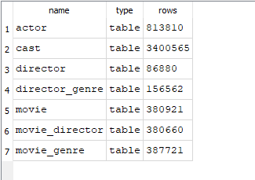

# Row count
```{sql eval=FALSE, include=FALSE}
--show row counts for all table present in the DB
SELECT 'actor' AS "name", 'table' AS "type", COUNT(*) AS "rows" FROM "actor"
UNION SELECT 'cast' AS "name", 'table' AS "type", COUNT(*) AS "rows" FROM "cast"
UNION SELECT 'director' AS "name", 'table' AS "type", COUNT(*) AS "rows" FROM "director"
UNION SELECT 'director_genre' AS "name", 'table' AS "type", COUNT(*) AS "rows" FROM "director_genre"
UNION SELECT 'movie' AS "name", 'table' AS "type", COUNT(*) AS "rows" FROM "movie"
UNION SELECT 'movie_director' AS "name", 'table' AS "type", COUNT(*) AS "rows" FROM "movie_director"
UNION SELECT 'movie_genre' AS "name", 'table' AS "type", COUNT(*) AS "rows" FROM "movie_genre"

```

