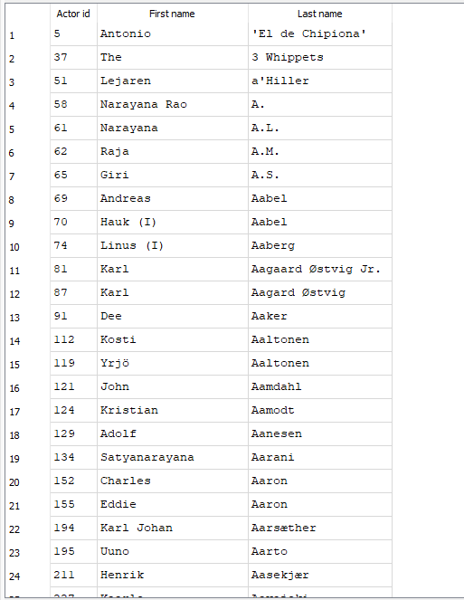

## In this Second set of queries, I'd be answering 4 questions about the IMDB database. 

### 1. List all directors in descending order of the number of movies they directed.

- To list all directors in descending order of the number of movies they directed, use the following SQL query:

```
SELECT d.id, 
  d.first_name AS "First name", 
  d.last_name AS "Last name", 
  COUNT(md.movie_id) AS "Movie count" --Count the number of movies each director has directed
FROM director d
--Join the director and movie_director tables to link directors with their movies.


JOIN movie_director md ON d.id = md.director_id
--Use GROUP BY to ensure each director is counted individually.
GROUP BY d.id, d.first_name, d.last_name
--Use ORDER BY to display the directors with the most movies first.
ORDER BY "Movie count" DESC;

```


Now we see a sample result of our query that shows the list of all directors in descending order of the number of movies they directed. 

### 2. Find the movie(s) with the largest cast and the movie(s) with the smallest cast. In both cases, return the size of the cast.

- To find the top 10 movies with the largest cast (i.e., the highest number of actors in the movie), use the following SQL query:

```
SELECT
  m.id, 
  m.name AS "Title", 
  COUNT(c.actor_id) AS "Cast size" --Counts the number of actor entries per movie to determine the cast size.
FROM movie m
--Join the movie and cast tables to link movies with their cast members.
JOIN cast c ON m.id = c.movie_id
--Use GROUP BY to count actors per movie.
GROUP BY m.id, m.name, m.year
--Use ORDER BY to list movies. DESC helps list the largest casts first.
ORDER BY "Cast size" DESC
--to return the top 10
LIMIT 10;

```

**Here is the result of our query showing the top 10 movies with the largest cast:**


- We can go further to add the year and ranking of these movies.

```

SELECT m.id, 
  m.name AS "Title", 
  m.year AS "Year", 
  rank AS "Ranking",
  COUNT(c.actor_id) AS "Cast size" --Counts the number of actor entries per movie to determine the cast size.
FROM movie m
--Join the movie and cast tables to link movies with their cast members.
JOIN cast c ON m.id = c.movie_id
--use GROUP BY to count actors per movie.
GROUP BY m.id, m.name, m.year
--Use ORDER BY to list movies. DESC helps list largest casts first.
ORDER BY "Cast size" DESC
--to return the top 10
LIMIT 10;

```
**Result of the above query:**


- We can see that some of the rankings are showing “NULL”, let's try to replace it with something else using the coalesce function.

```
SELECT m.id, 
  m.name AS "Title", 
  m.year AS "Year", 
  --the coalesce function replaces "Null" with "Not available"
  coalesce(rank,'Not Available') AS "Ranking",
COUNT(c.actor_id) AS "Cast size" --Counts the number of actor entries per movie to determine the cast size.
FROM movie m
--Join the movie and cast tables to link movies with their cast members.
JOIN cast c ON m.id = c.movie_id
--use GROUP BY to count actors per movie.
GROUP BY m.id, m.name, m.year
--Use ORDER BY to list movies. DESC helps list largest casts first.
ORDER BY "Cast size" DESC
--to return the top 10
LIMIT 10;

```


It's a little better now. As we can see, "Null" is now replaced with "Not available" by the coalesce function. 

- **NB: To get the movies with the smallest cast, just replace 'DESC' with 'ASC' in 'the ORDER BY'.**


### 3. Find all the actors who acted in movies by at least 10 distinct directors (i.e. actors who worked with at least 10 distinct directors).

- To find all actors who have acted in movies directed by at least 10 distinct directors, you can use this SQL query:

```
SELECT a.id, 
  a.first_name as "First name", 
  a.last_name as "Last name", 
  COUNT(DISTINCT md.director_id) AS "Director count"
FROM actor a
--Join actor, cast, and movie_director to link actors with movies and their directors.
JOIN cast c ON a.id = c.actor_id
JOIN movie_director md ON c.movie_id = md.movie_id
--group by actor to get the total number of directors for each actor.
GROUP BY a.id, a.first_name, a.last_name
--Count distinct "director IDs" To keep track of how many different directors an actor has collaborated with.
--HAVING clause makes sure we are left with just those with 10 or more distinct directors.
HAVING COUNT(DISTINCT md.director_id) >= 10;

```
**Result of the above query:**


- We can go further by adding the number of movies and ordering the results. The result is sorted by number of directors (and number of movies, if tied).

```
SELECT a.id, 
  a.first_name as "First name", 
  a.last_name as "Last name", 
  COUNT(DISTINCT md.director_id) AS "Director count",
  COUNT(DISTINCT c.movie_id) AS "No of Movies"
FROM actor a
--To obtain the movies they starred in, we join 'actor' with 'cast'.
--To obtain the directors of those movies, we then join 'cast' with movie_director.
JOIN cast c ON a.id = c.actor_id
JOIN movie_director md ON c.movie_id = md.movie_id
--group by actor to get the total number of directors for each actor.
GROUP BY a.id, a.first_name, a.last_name
--Count distinct "director IDs" To keep track of how many different directors an actor has collaborated with.
--HAVING clause makes sure we are left with just those with 10 or more distinct directors.
HAVING COUNT(DISTINCT md.director_id) >= 10
ORDER BY "Director count" DESC, "No of Movies" DESC;

```
**Result of the above query:**


- Let's add the average movie ranking.

```
SELECT a.id, 
  a.first_name as "First name", 
  a.last_name as "Last name", 
  COUNT(DISTINCT md.director_id) AS "Director count",
  COUNT(DISTINCT c.movie_id) AS "No of Movies",
--AVG calculates the actor's average movie rank, while ROUND restricts the decimal places to two for a clearer output.
ROUND(AVG(m.rank), 2) AS "Avg movie rank"
FROM actor a
--To obtain the movies they starred in, we join actor with cast.
--To obtain the directors of those movies, we then join cast with movie_director.
JOIN cast c ON a.id = c.actor_id
JOIN movie_director md ON c.movie_id = md.movie_id
JOIN movie m ON c.movie_id = m.id

--group by actor to get the total number of directors for each actor.
GROUP BY a.id, a.first_name, a.last_name
--Count distinct "director IDs" To keep track of how many different directors an actor has collaborated with.
--HAVING clause makes sure we are left with just those with 10 or more distinct directors.
HAVING COUNT(DISTINCT md.director_id) >= 10
ORDER BY "Director count" DESC, "No of Movies" DESC;

```
**Result of the above query:**

Now we can see the average movie rank of the movies. 


- Let's say we want only female actors who worked with at least 10 distinct directors, along with the number of movies and their average movie rank:
  
```
SELECT a.id, 
  a.first_name as "First name", 
  a.last_name as "Last name", 
  COUNT(DISTINCT md.director_id) AS "Director count",
  COUNT(DISTINCT c.movie_id) AS "No of Movies",
  --AVG calculates the actor's average movie rank, while ROUND restricts the decimal places to two for a clearer output.
  ROUND(AVG(m.rank), 2) AS "Avg movie rank"
FROM actor a
--To obtain the movies they starred in, we join actor with cast.
--To obtain the directors of those movies, we then join cast with movie_director.
JOIN cast c ON a.id = c.actor_id
JOIN movie_director md ON c.movie_id = md.movie_id
JOIN movie m ON c.movie_id = m.id
WHERE gender = "F"
--group by actor to get the total number of directors for each actor.
GROUP BY a.id, a.first_name, a.last_name
--Count distinct "director IDs" To keep track of how many different directors an actor has collaborated with.
--HAVING clause makes sure we are left with just those with 10 or more distinct directors.
HAVING COUNT(DISTINCT md.director_id) >= 10
ORDER BY "Director count" DESC, "No of Movies" DESC;

```
**Result of the above query:**

We filtered by gender using the where clause. Now we have only female actors who worked with at least 10 distinct directors. 
  


- **NB: To get only male actors, switch ‘F’ to 'M'.You can also remove the WHERE clause if you want to get all genders again.**


### 4. Find all actors who acted only in movies before 1960. 

- To find all actors who acted only in movies before 1960, you can use this SQL query:

```
SELECT
    a.id as "Actor id", 
    a.first_name as "First name", 
    a.last_name as "Last name"
FROM actor a
--We join actor, cast, and movie to get the actor's movie info.
JOIN cast c ON a.id = c.actor_id
JOIN movie m ON c.movie_id = m.id
GROUP BY a.id, a.first_name, a.last_name
HAVING MAX(m.year) < 1960

```
**Result of the above query:**



- Let's add how many movies each of those actors appeared in and the average movie rank.

```
SELECT
    a.id as "Actor id", 
    a.first_name as "First name", 
    a.last_name as "Last name",
--Count is used to get the number of movies each actor appeared in 
    COUNT(DISTINCT c.movie_id) AS "No of Movies",
	--AVG gives their average movie rank, rounded to 2 decimals.
	ROUND(AVG(m.rank), 2) AS "Avg movie rank"
FROM actor a
--We join actor, cast, and movie to get the actor's movie info.
JOIN cast c ON a.id = c.actor_id
JOIN movie m ON c.movie_id = m.id
GROUP BY a.id, a.first_name, a.last_name
--MAX in the HAVING clause ensures the actor never appeared in any movie from 1960 or later.
HAVING MAX(m.year) < 1960
--ORDER BY lets you see the most prolific and highest-ranked actors first.
ORDER BY "No of Movies" DESC, "Avg movie rank" DESC;

```
**Result of the above query:**


**Now we see all the actors who acted only in movies before 1960, the number of movies they appeared in, and the average movie rank.**


### 5. Find the movies with more women actors than men.

- To find the movies with more women actors than men, you can use this SQL query:

```
SELECT
    m.id AS "Movie id", 
    m.name AS "Movie name", 
    m.year AS "Movie year"
FROM movie m
--Join movie, cast, and actor to get actor gender info per movie.
JOIN cast c ON m.id = c.movie_id
JOIN actor a ON c.actor_id = a.id
--Group by movie to calculate gender counts per movie.
GROUP BY m.id, m.name, m.year
--The HAVING clause filters only the movies where the count of women is greater than the count of men.
HAVING 
-- Count how many women 
  SUM(CASE WHEN a.gender = 'F' THEN 1 ELSE 0 END) >
  -- Count how many men 
  SUM(CASE WHEN a.gender = 'M' THEN 1 ELSE 0 END);

```
**Sample Result of the above query:**


- Now we know the movies with more men than women. Let's move 2 steps further by including the actual number of women and men per movie, then also getting the percentage of women and men in the cast.

We can achieve that by using the following SQL query:

```
SELECT
    m.id AS "Movie id", 
		m.name AS "Movie name", 
		m.year AS "Movie year",
		m.rank AS "Ranking",
--counts the total number of cast
	COUNT(*) AS "Total cast",
	--Uses CASE WHEN logic to count and display the number of women and men separately.
    SUM(CASE WHEN a.gender = 'F' THEN 1 ELSE 0 END) AS "Women count",
    SUM(CASE WHEN a.gender = 'M' THEN 1 ELSE 0 END) AS "Men count",
	--Percentages are calculated and rounded to 2 decimal places.
    ROUND(100.0 * SUM(CASE WHEN a.gender = 'F' THEN 1 ELSE 0 END) / COUNT(*), 2) AS "Women percentage",
    ROUND(100.0 * SUM(CASE WHEN a.gender = 'M' THEN 1 ELSE 0 END) / COUNT(*), 2) AS "Men percentage"
FROM movie m
--Join movie, cast, and actor to get actor gender info per movie.
JOIN cast c ON m.id = c.movie_id
JOIN actor a ON c.actor_id = a.id
--Group by movie to calculate gender counts per movie.
GROUP BY m.id, m.name, m.year, m.rank
--The HAVING clause filters only the movies where the count of women is greater than the count of men.
HAVING 
-- count how many women 
  SUM(CASE WHEN a.gender = 'F' THEN 1 ELSE 0 END) >
  -- count how many men 
  SUM(CASE WHEN a.gender = 'M' THEN 1 ELSE 0 END)
 ORDER BY "Women percentage" DESC, m.rank DESC NULLS LAST;

```

**Sample Result of the above query:**


